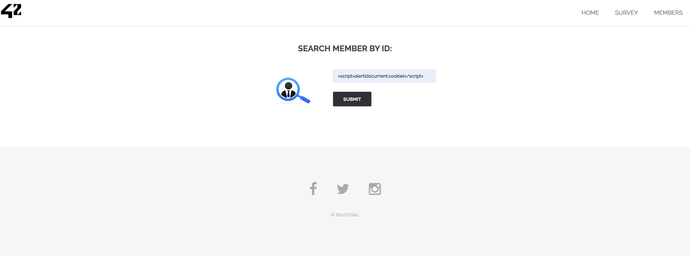
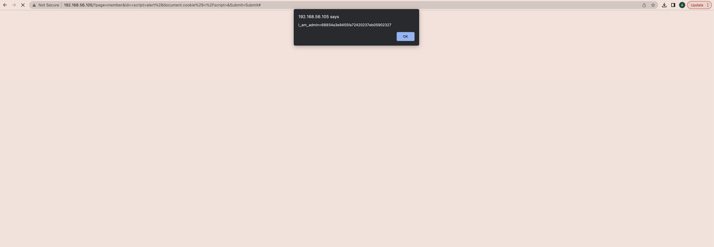
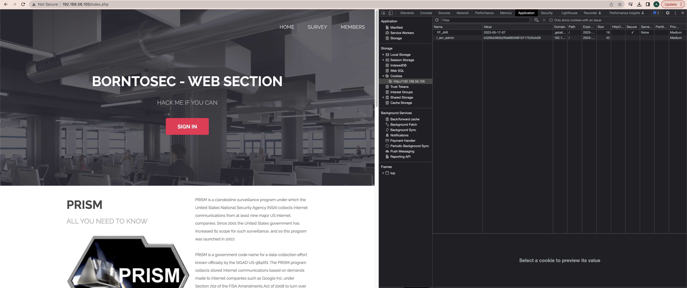
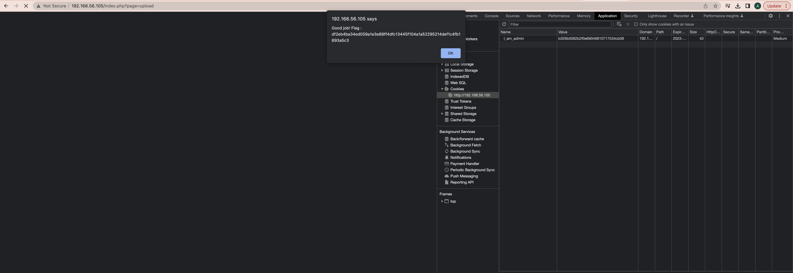

# Cookie
While I was joking with XSS attacks, I found another vulnerability related to cookies.  
On the member search page by id I entered the js script...  

...and got a cookie


So, we see ```I_am_admin=68934a3e9455fa72420237eb05902327``` cookie.  
MD5 decryption of "68934a3e9455fa72420237eb05902327" gives the value "false".  
Let's encrypt the "true":  
MD5("true") = "b326b5062b2f0e69046810717534cb09"

Now changed the value of cookie


Press any button on the site and BOOM! We are admin.


## Explanation
Attack type: [Broken Authentication](https://owasp.org/www-project-top-ten/2017/A2_2017-Broken_Authentication)
> Confirmation of the user’s identity, authentication, and session management are critical to protect against authentication-related attacks.

## How to fix it
> Don't put important information on Cookies.
> Where possible, implement multi-factor authentication to prevent automated, credential stuffing, brute force, and stolen credential re-use attacks.
