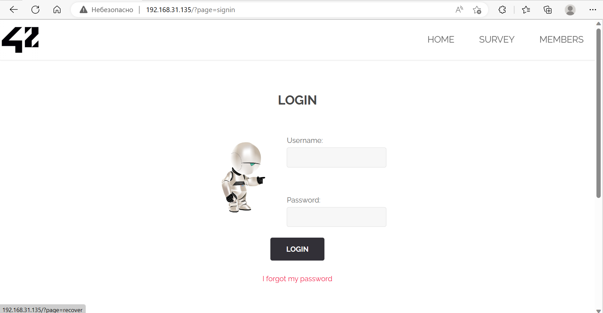
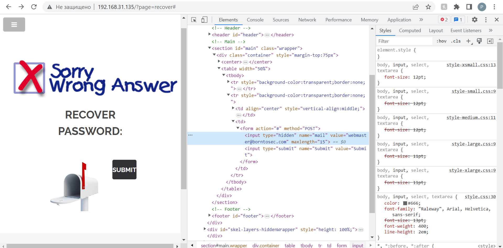
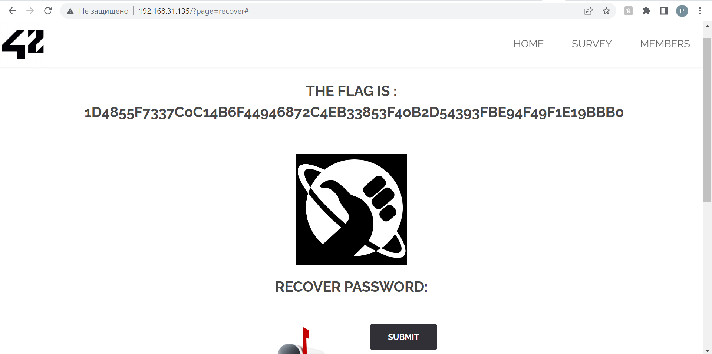

# Recover

Go to `Sign In` page <http://[VM_IP]/?page=signin> and then to <http://[VM_IP]/?page=recover#> by clicking `I forgot my password`. 



If we click `Submit` nothing much happens. 

Let's look at the source code on recover page. We have a hidden input for submit:

```
[...]
<form action="#" method="POST">
	<input type="hidden" name="mail" value="webmaster@borntosec.com" maxlength="15">
	<input type="submit" name="Submit" value= "Submit">
</form>
[...]
```



So the recovery password is sent to *webmaster@borntosec.com*.
We can remove this hidden input with developer tools in Source and then click on `Submit`.

We have our flag



## Explanation

Attack type: [Web Parameter Tampering](https://owasp.org/www-community/attacks/Web_Parameter_Tampering): Hidden field manipulation

> When a web application uses hidden fields to store status information, a malicious user can tamper with the values stored on their browser and change the referred information.

Once the adversary has determined which hidden fields are not being validated by the server, they will manipulate them to change the normal behavior of the web application in a way that benefits the adversary.

## How to fix it

> The attack success depends on integrity and logic validation mechanism errors.

Validate sent data on server correctly.
