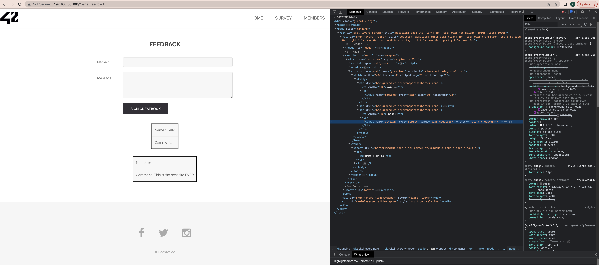

# XSS basic


When the submit button of the form is clicked, checkForm is called, but this function is not implemented.
```
<input name="btnSign" type="Submit" value="Sign Guestbook" onclick="return checkForm();">
```

We can try to implement this function through developer tools.
```
function checkForm()
{
    document.guestform.setAttribute("onsubmit", "return true");
}
```
We press the button...So...It doesn't work...

If we write the word script in the feedback form, we get a flag.

## Explanation
Attack type: [XSS](https://owasp.org/www-community/attacks/xss/): Cross Site Scripting
> Cross-Site Scripting (XSS) attacks are a type of injection, in which malicious scripts are injected into otherwise benign and trusted websites. 
> XSS attacks occur when an attacker uses a web application to send malicious code, generally in the form of a browser side script, to a different end user.
> Flaws that allow these attacks to succeed are quite widespread and occur anywhere a web application uses input from a user within the output it generates without validating or encoding it.

## How to fix it
> To escape the XSS, you have to sanitize and validate all the input data.